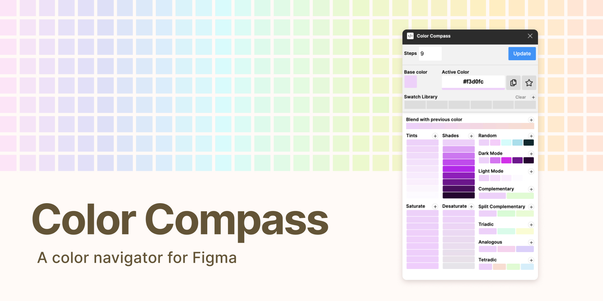

## This plugin was designed to make choosing colors a more accurate and efficient affair by generating color palettes using a single base color. ♥

### To Use:
- Run the plugin from Figma
- Select an element containing a fill or background
- Click on 'Update' to update the plugin's palette

### Notes:
- While an element is selected you can keep clicking on 'Update' to generate random color palettes.
- Click on the plus button next to the palette label to add the swatches to your document.
- This plugin will work on any element that contains a **solid** fill or background.
- You can click on a swatch to update the currently selected element's fill or background.

-----------
♡ If you run into any bugs or have any feature requests please submit an issue.